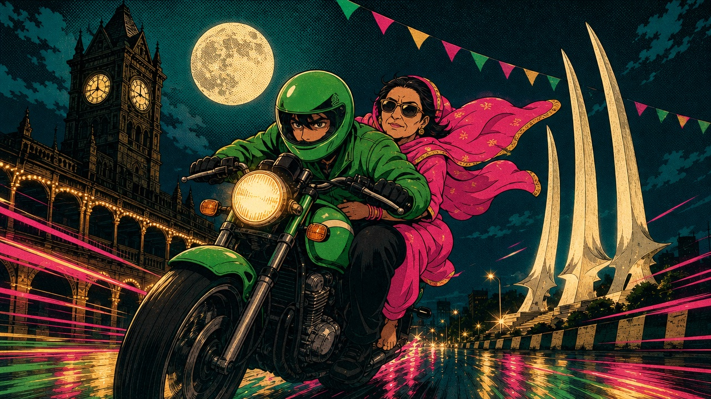

<div align="center">

# 🏍️ Bykea ki Sawari

**A tiny Karachi bike-taxi game. Pick up your sawari at Empress Market, survive Saddar's traffic, drop them at Teen Talwar.**

One run ≈ 45–70 seconds — exactly one tweet-length video.

[](https://bykea-ki-sawari.vercel.app)




</div>

---

## ✨ What it is

A vanilla **three.js** browser game — no game engine, no framework, no physics library. The entire city of Karachi (Empress Market → Teen Talwar) is built procedurally from canvas textures and box geometry, dressed with a handful of AI-generated sprite cutouts. Every sound except the voice lines is synthesised live in WebAudio (zero copyrighted assets).

- 🛺 **Two playable sawariyan** — *Ganji Swag* (whose blood pressure boils in traffic and turns rage into viral "Traffic Tales") and *Rishta Aunty* (who interviews you as a marriage prospect, biodata questions and all).
- 🗣️ **Fully voiced** in Urdu/Roman-Urdu, reacting live to jams, wrong-way riders, potholes, and your driving.
- 🏙️ **A real route** — Empress Market, Zainab Market, Regal Chowk, Frere Hall, Clifton Bridge, Park Towers, Teen Talwar — modelled from reference photos. Saddar is rushy and trashy; Clifton is clean and calm.
- 💸 **Haggle the fare**, dodge the W-11, honk like you mean it, and score a star rating you can post on 𝕏.
- 📱 **Mobile-first & adaptive** — auto-detects device strength and live FPS, keeping old/low-end Androids smooth while letting flagships run the full dense city.

## 🎮 Controls

| | Desktop | Mobile |
|---|---|---|
| Steer | `←` `→` (or `A` `D`) | Tap left / right half of the screen |
| Race (boost) | `↑` (or `W`) | Hold **RACE** |
| Horn | `Space` | Tap **HORN** |
| Pause | `Esc` | ⏸ button |
| Mute | `M` | 🔊 button |

## 🚀 Getting started

**Prerequisites:** [Node.js](https://nodejs.org) 18+ and npm.

```bash
# 1. Install
npm install

# 2. Run the dev server (hot-reload).
#    --host is on by default so you can play-test on your phone over LAN.
npm run dev

# 3. Type-check + production build → dist/
npm run build

# 4. Preview the production build locally
npm run preview
```

> The game is fully playable straight after `npm install` — all art and audio
> assets are committed. You only need an API key if you want to **regenerate**
> the voice lines (see [Audio](#-audio)).

## 📂 Project structure

```
bykea-ki-sawari/
├── index.html              # Single entry; all UI markup lives here
├── public/                 # Static assets served as-is
│   ├── img/                # AI sprite cutouts (vehicles, cast, facades, trash)
│   ├── audio/              # Generated voice lines, sfx & music (~5 MB)
│   ├── manifest.webmanifest
│   ├── sw.js               # Service worker (cache-first runtime caching)
│   ├── start-art.jpg       # Title-screen key art / social share image
│   └── bykea-logo.png
├── src/
│   ├── main.ts             # Game loop, states, input, camera, collisions, wiring
│   ├── quality.ts          # Adaptive device-tier detection + live downgrade
│   ├── config.ts           # Route, speeds, mood, cast definitions
│   ├── world.ts            # The entire static city (atmosphere → street life)
│   ├── facades.ts          # Canvas-texture generators for buildings/signs
│   ├── traffic.ts          # NPC vehicles: spawn/despawn, lanes, bus races
│   ├── player.ts           # Bike + rider + passenger models, arcade physics
│   ├── passengers.ts       # Passenger dialog, haggling, reviews, roasts
│   ├── rider.ts            # Ganji Swag's voice lines + clip manifest
│   ├── aunty.ts            # Rishta Aunty's voice lines + clip manifest
│   ├── voices.ts           # Dialog → mp3 clip-id manifest
│   ├── audio.ts            # Procedural WebAudio + generated-clip playback
│   ├── ui.ts               # All DOM: screens, HUD, bubbles, score card
│   ├── util.ts             # Texture/chroma-key/geometry helpers
│   └── style.css           # Truck-art UI styling (mobile-first)
├── scripts/
│   └── gen_audio.py        # ElevenLabs voice/sfx/music generation (optional)
├── docs/                   # Architecture, world map, audio pipeline, roadmap
├── vite.config.ts
├── vercel.json             # Deploy + asset cache headers
└── tsconfig.json
```

See [`docs/`](docs/) for deeper notes:
[OVERVIEW](docs/OVERVIEW.md) · [ARCHITECTURE](docs/ARCHITECTURE.md) · [WORLD](docs/WORLD.md) · [AUDIO](docs/AUDIO.md) · [ROADMAP](docs/ROADMAP.md).

## ⚡ Performance & adaptive quality

90% of players are on mobile, so smoothness is the priority. On boot, [`src/quality.ts`](src/quality.ts) picks a tier (`low` / `mid` / `high`) from device RAM, CPU cores and pixel density, then a live FPS watchdog in the main loop **demotes** quality if frames drop — lowering render resolution, disabling MSAA, and thinning traffic & crowd density. It only ever steps down, so quality never oscillates, and the lowest tier reached is remembered for next visit.

Force a tier for testing with a URL param:

```
?q=low    ?q=mid    ?q=high
```

## 🔊 Audio

All voice lines, sound effects and music in `public/audio/` are generated by
[`scripts/gen_audio.py`](scripts/gen_audio.py) via the ElevenLabs API. **You do
not need this to play or build the game** — the audio is committed.

To regenerate it:

```bash
cp .env.example .env.local      # then add your ELEVEN_KEY
ELEVEN_KEY=your_key python3 scripts/gen_audio.py
```

The key is read from the environment only and is **never** bundled into client
code. See [`docs/AUDIO.md`](docs/AUDIO.md) for the voice/clip contract.

## ☁️ Deployment (Vercel)

The build is a static SPA — any static host works. For Vercel:

```bash
npm i -g vercel
vercel            # first run links/creates the project (name it bykea-ki-sawari)
vercel --prod     # ship it
```

`vercel.json` sets long-lived cache headers on hashed build assets. After your
first deploy, update the live-demo URL in this README and the `og:image` /
canonical URL in [`index.html`](index.html) to your real domain so 𝕏 share
cards render correctly.

## ⚠️ Disclaimer

- Made in Karachi with **Fable 5** 💚
- A fan-made **parody / satire** game. Commercial brand names in-game are used in
  a parody spirit ("Stoodent Biryani", "Sarvis Shoes", "Limtown Watch Co");
  landmark and place names are real.
- Character voices are AI-generated (ElevenLabs). No real person's name, photo,
  or likeness is used in the game.
- **Not affiliated with, endorsed by, or representative of any real company or
  person.** All trademarks are the property of their respective owners.

## 📝 License

**Source code** is released under the [MIT License](LICENSE).

**Assets are not** — the contents of `public/img/`, `public/audio/`,
`public/start-art.jpg` and `public/bykea-logo.png` (AI-generated art, voice
clips, and brand marks) are **all rights reserved** and are excluded from the
MIT grant. Don't reuse them without permission.
